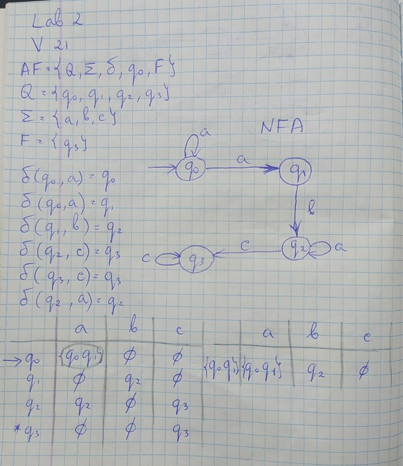
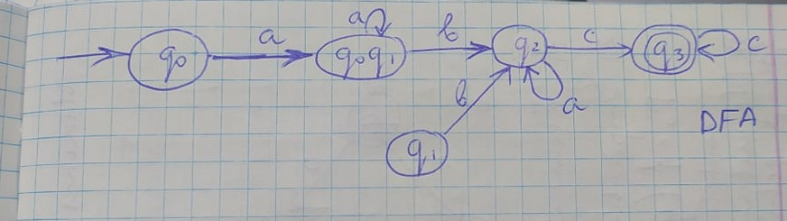
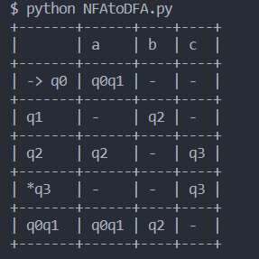

# Conversion of Nondeterministic Finite Automaton to Deterministic Finite Automaton

1. Convert NFA from your variant to DFA on paper, writing all transitions and drawing converted automaton.
   
   
2. Write a program that converts nondeterministic finite automaton (NFA) to deterministic finite automaton (DFA)

In the NFAtoDFA.py file, the function NFAtoDFA is responsible for the conversion.

Files v1.txt, v12.txt, and v21.txt contain some sample tests to check if the algorithm works properly for different cases.

3. Display converted automaton in form of graph or transition table

Function PrintTable from the NFAtoDFA.py file is responsible for printing the table for the resulting DFA.

Below is a picture of the resulted table for the v21.txt input

